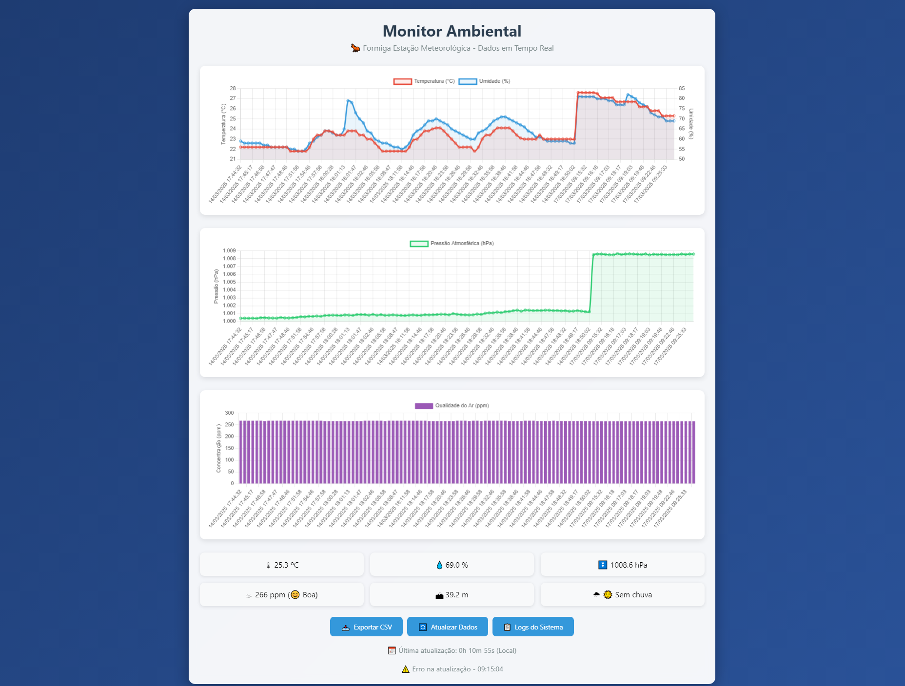
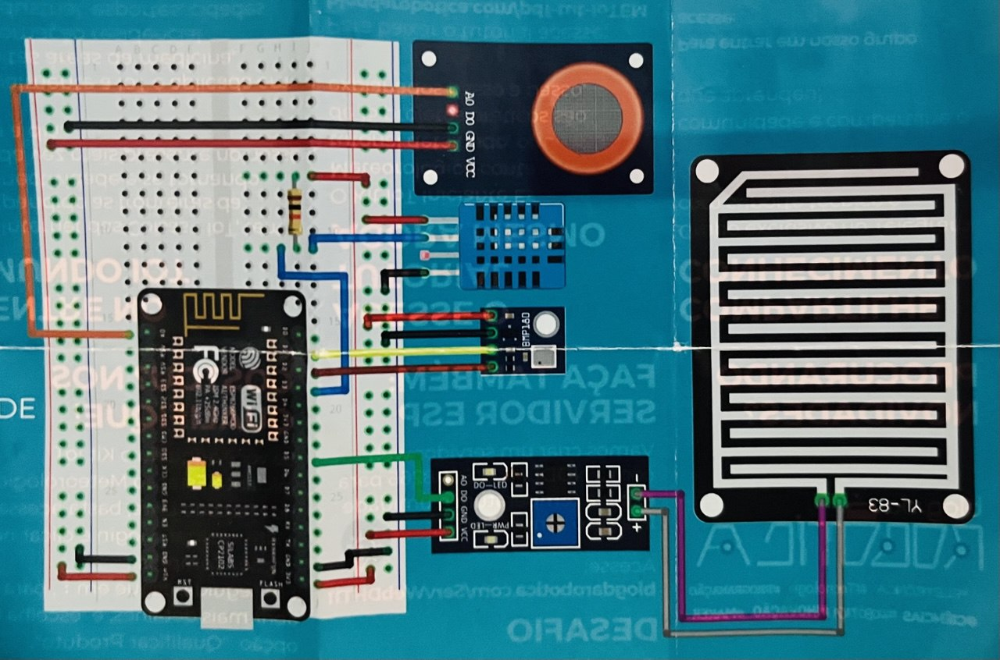

# FormigaWeather - Estação Meteorológica IoT 🌐🌡️  
*Sua estação meteorológica IoT de baixo custo e código aberto*

🌦️ Um projeto open-source de estação meteorológica IoT para monitorar qualidade do ar, temperatura, umidade, pressão e chuva.   Desenvolvido com NodeMCU ESP8266, sensores MQ-135, BMP180, DHT11 e módulo de chuva MH-RD.   Dados acessíveis via web server responsivo e exportáveis para CSV. Ideal para makers, educadores e entusiastas de IoT!

[](https://opensource.org/licenses/MIT)
[](https://github.com/jancarauma/FormigaWeather)

  
*Captura do Web Server Responsivo*

## 🚀 Funcionalidades
Um sistema IoT completo para monitoramento ambiental, capaz de:

- **Interface Web Responsiva:**  
  O ESP8266 hospeda um site acessível via `http://estacaoformiga.local` na rede WiFi local, se não houver rede WiFi disponível, o ESP cria a rede WiFi ainda assim, ideal para locais sem disponibilidade de internet, exibindo os dados dos sensores em tempo real para acesso local.

- **Medição de Qualidade do Ar:**  
  Utiliza o sensor **MQ-135** para detecção de gases e poluentes.

- **Medição Barométrica:**  
  O sensor **BMP180** mede pressão atmosférica e possibilita estimativas, inclusive, de altitude.

- **Medição de Temperatura e Umidade:**  
  O sensor **DHT11** capta informações de temperatura e umidade relativa.

- **Detecção de Chuva:**  
  Sensor **MH-RD Raindrops** para monitorar a presença de chuva.

- **Exportação CSV e Logs:**  
  O site conta com um botão para exportar os dados em formato CSV e outro para monitorar os logs do sistema.

## 📟 Componentes Utilizados
| Componente          | Função                          | Qtd |
|---------------------|---------------------------------|-----|
| NodeMCU ESP8266     | Microcontrolador Wi-Fi          |  1  |
| Sensor MQ-135       | Qualidade do ar (CO2/VOC)       |  1  |
| Sensor BMP180       | Pressão atmosférica e altitude  |  1  |
| Sensor DHT11        | Temperatura e umidade           |  1  |
| Módulo MH-RD        | Detecção de chuva               |  1  |
| Resistor 10kΩ       | Pull-up para DHT11              |  1  |
| Protoboard          | Placa de prototipagem           |  1  |
| Fios jumper         | Fios diversos para conexões     |  1  |

## 🔌 Diagrama de Ligações
  
*Exemplo de conexão dos sensores com o NodeMCU:*
- DHT11 ➔ GPIO4 (D2) + resistor 10kΩ
- BMP180 ➔ I2C (SDA: D1, SCL: D2)
- MQ-135 ➔ A0
- MH-RD ➔ D5

## ⚙️ Configuração

### Pré-requisitos

Antes de começar, certifique-se de ter o seguinte instalado e configurado:

- **Arduino IDE 1.8.18 ou superior**
- **Bibliotecas Necessárias:**
  - `Adafruit BMP085 Library`
  - `DHT sensor library`
  - `ESP8266WiFi`

#### Configuração da IDE e Instalação das Bibliotecas

1. **Configurar o Gerenciador de Placas para ESP8266:**
   - Abra a Arduino IDE.
   - Vá em **Arquivo > Preferências**.
   - No campo "URLs adicionais para gerenciadores de placas", adicione:
     ```
     http://arduino.esp8266.com/stable/package_esp8266com_index.json
     ```
   - Clique em "OK".
   - Acesse **Ferramentas > Placa > Gerenciador de Placas**.
   - Busque por "ESP8266" e instale o pacote correspondente.
   - Em **Ferramentas > Placa**, selecione a opção **NodeMCU 1.0 (ESP-12E Module)**.

2. **Instalar a Biblioteca Adafruit BMP085:**
   - Faça o download da biblioteca através deste [link](https://github.com/jancarauma/FormigaWeather/blob/main/Adafruit_Sensor-master.zip).
   - Na Arduino IDE, vá em **Sketch > Incluir Biblioteca > Adicionar Biblioteca .ZIP**.
   - Selecione o arquivo baixado e conclua a instalação.

3. **Instalar a Biblioteca DHT sensor library:**
   - Faça o download da biblioteca através deste [link](https://github.com/jancarauma/FormigaWeather/blob/main/DHT-sensor-library.zip).
   - Na Arduino IDE, vá em **Sketch > Incluir Biblioteca > Adicionar Biblioteca .ZIP**.
   - Selecione o arquivo baixado e conclua a instalação.

Após seguir esses passos, sua Arduino IDE estará configurada corretamente para compilar e carregar o projeto da estação no NodeMCU ESP8266.

### Instalação
1. Clone o repositório:
   ```bash
   git clone https://github.com/seuuser/FormigaWeather.git
   ```
2. Abra o projeto na Arduino IDE:
   - Certifique-se de que sua IDE Arduino esteja configurada conforme os pré-requisitos.
   - Abra o arquivo [estacao_formiga.ino](estacao_formiga.ino).
3. Configure a rede WiFi:
   - No código, altere a variável ssid (atualmente "dlink") para o nome da sua rede WiFi.
   - Modifique a variável password para a senha da sua rede WiFi.
4. Verifique as conexões do circuito:
   - Confirme se todas as ligações do circuito da estação estão corretas.
5. Carregue o código no ESP8266:
   - Conecte o ESP8266 via USB ao seu computador.
   - Selecione a porta correta e faça o upload do código.
6. Monitore a saída serial:
   - Abra o Monitor Serial na Arduino IDE para verificar se o dispositivo está funcionando corretamente ou se há alguma mensagem de erro.
7. Acesse a interface web:
  - Caso não haja erros, conecte seu computador ou celular à mesma rede WiFi do ESP8266.
  - Se não houver rede WiFi disponível, o ESP8266 criará uma rede própria chamada Estacao_Formiga com a senha senha123.
  - Em seguida, abra seu navegador e acesse: http://estacaoformiga.local ou utilize o endereço IP exibido no Monitor Serial.

## 🖥️ Como Usar
- Conecte-se à mesma rede Wi-Fi da estação
- Acesse http://estacaoformiga.local ou o IP local do NodeMCU (Disponível no Monitor Serial)
- Interaja com os botões:
  - 📥 Exportar CSV: Gera arquivo com dados no formato:
    - Data, Hora, Temperatura, Umidade,Pressao,QualidadeAr,Chuva

  - 📜 Logs do Sistema: Exibe histórico de conexões e eventos

## 🌟 Contribuição
Contribuições são bem-vindas! Siga estes passos:

- Faça um fork do projeto
- Crie uma branch (git checkout -b feature/nova-feature)
- Commit suas mudanças (git commit -m 'Adiciona nova feature')
- Push para a branch (git push origin feature/nova-feature)
- Abra um Pull Request

## 📄 Licença
Distribuído sob licença MIT. Veja LICENSE para mais detalhes.

## 🙌 Agradecimentos
- Comunidade Arduino/ESP8266
- Autores das bibliotecas utilizadas
- Inspiração em projetos open-source de IoT
